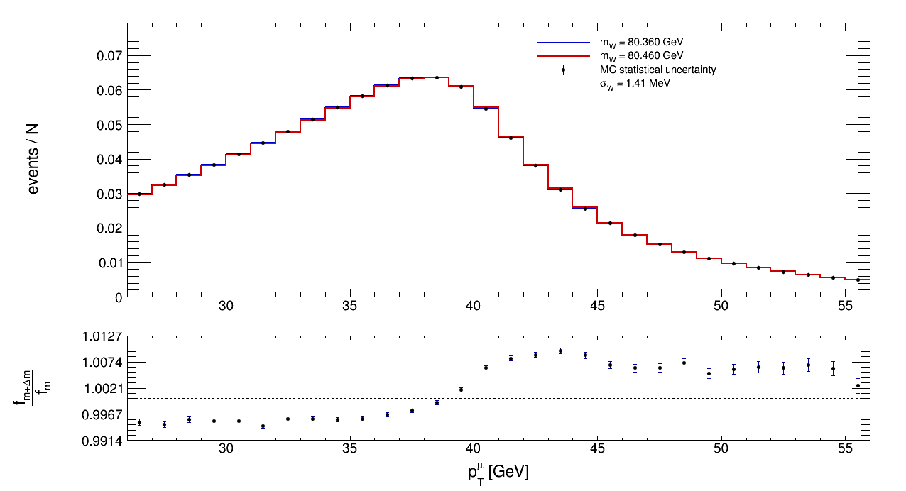

# Stima della sensibilità alla massa del bosone W

Simulazione Monte Carlo per lo studio della sensibilità statistica alla massa del bosone W attraverso la distribuzione del momento trasverso del muone prodotto nel decadimento

$$
W \rightarrow \mu\nu.
$$

## Descrizione

L'obiettivo del progetto è studiare quanta informazione sulla massa del bosone W, $M_W$, è contenuta nella distribuzione del momento trasverso del muone, $p_T^\mu$.